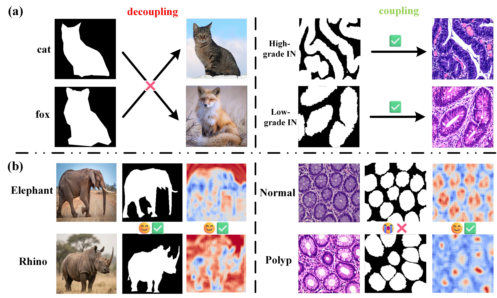
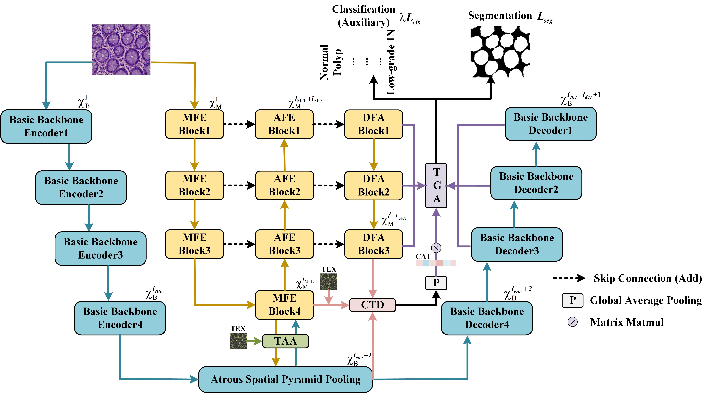
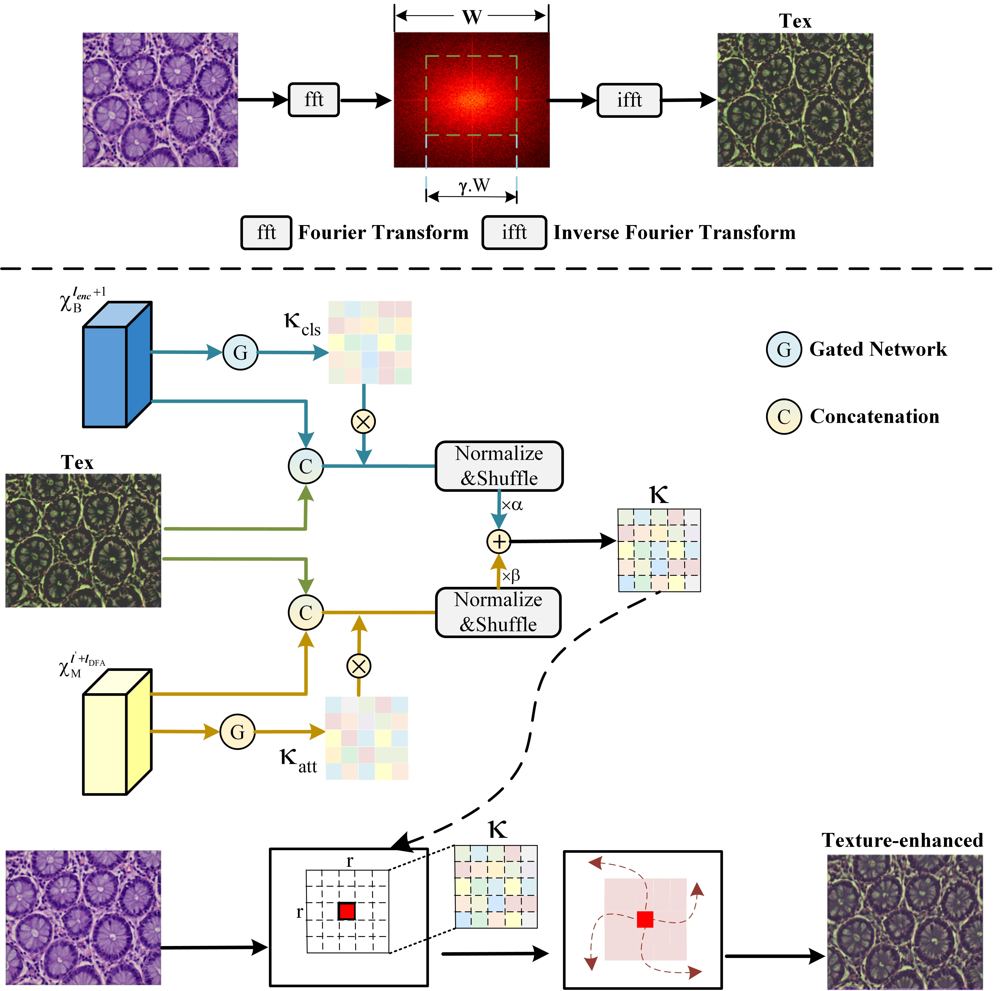
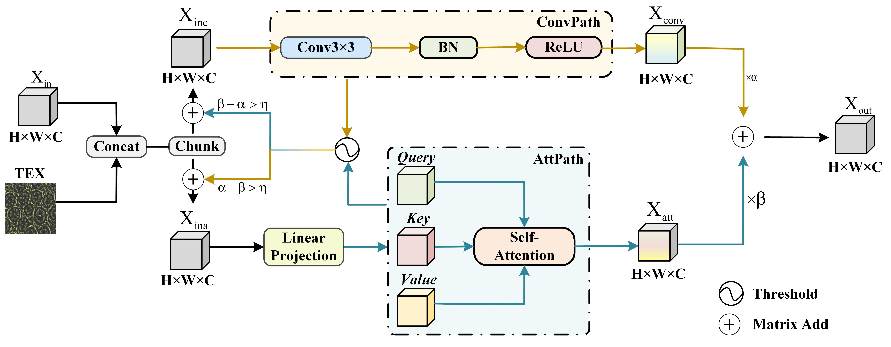
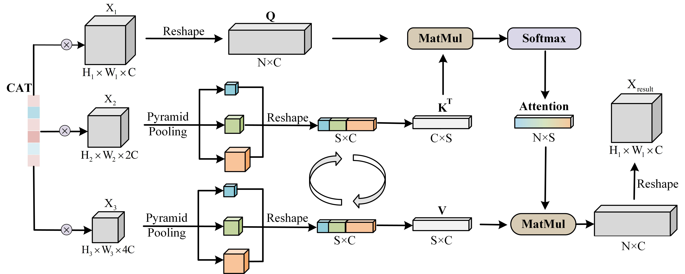

# When Texture Meets Classification: A Dual-Prior Framework for Pathological Image Segmentation

[](https://github.com/wzydcg/DPNet)
[](https://github.com/wzydcg/DPNet)


---

## Introduction

## Approach



## Conditional Texture Diffusion


## Texture-Aware Attention


## Texture-Guided Attention


## Dataset

Download the EBHI-Seg dataset from [here](https://www.kaggle.com/datasets/orvile/ebhi-seg-colorectal-cancer).

Download the SegPANDA200 dataset from [here](https://drive.google.com/drive/folders/1kPWiFxL5HxVRM4antSPq9FzjBIbmkGWA).

Download the MoNuSeg2018 dataset from [here](https://drive.google.com/file/d/1ZgqFJomqQGNnsx7w7QBzQQMVA16lbVCA/view).

## Training

### Default Scripts
All default hyperparameters among these models are tuned for EBHI-Seg datasets.

Wandb is needed if visualization of training parameters is wanted

### Customized Execution

run script like this:
```bash
python main.py \
--model Our_UNet \
--dataset RAOS \
--batch_size 4 \
--num_epochs 200 \
--learning_rate 1e-4 \
--dropout 0.1 \
--do_train \
--do_evaluate
```

## Dependencies
- python==3.12
- opencv-python==4.7.0.68
- einops
- nilearn==0.10.4
- scikit-learn==1.3.2
- scipy
- torch==2.3.0
- pydicom==2.4.4
- pandas==1.5.3
- nibabel==5.2.1
- wandb

## Citation

```
@ARTICLE{
  author={Wang, Zhiyan and Wang, Changjian and Xu, Kele},
  journal={}, 
  title={When Texture Meets Classification: A Dual-Prior Framework for Pathological Image Segmentation}, 
  year={2026},
  volume={},
  number={},
  pages={},
  keywords={Pathological image Segmentation, Pathological image classification, Dual-Prior},
  doi={}}

```

## Contact Us

If you are interested to leave a message, please feel free to send any email to us at ```wangzhiyan24@nudt.edu.cn```
